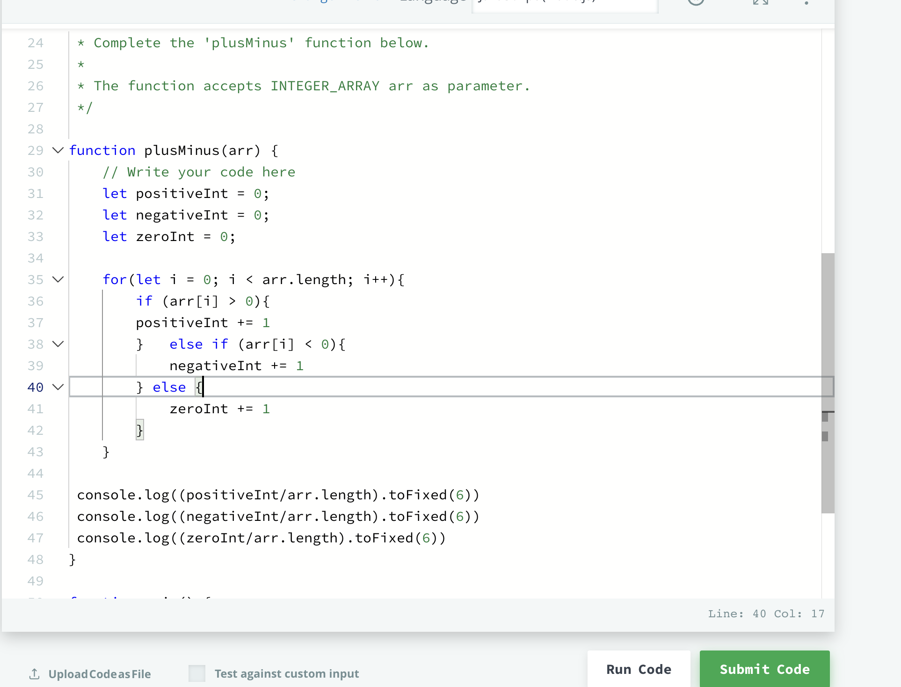

 
# Plus-minus Hacker Rank Challenge
 - The problem wants me to solve the ratio to positive, negative, and zero integers. I have to print the ratio in decimal format 6 places after the decimal. 
- The parameter is an array of numbers arr[n]
Input format is as follows : first line contains an integer , n and the size of the array and second line contains n space separated  integers that describe the arr[n]
1. I first need counter variables for the 3 different integer types
2. I need to loop over the array parameter
3. Once I loop I will need an if else statement to find what numbers are less , greater, and equal to zero. 
4. Once I write out those conditionals if they are met then I would add one to each number 
5. Then I would print the results using console.log() I would divide the pos int, neg int, and zero int by the arr.length. 
6. Then the number I would receive needs to be converted to a number to the 6th decimal and I would use the toFixed(6) method to get that done. 

