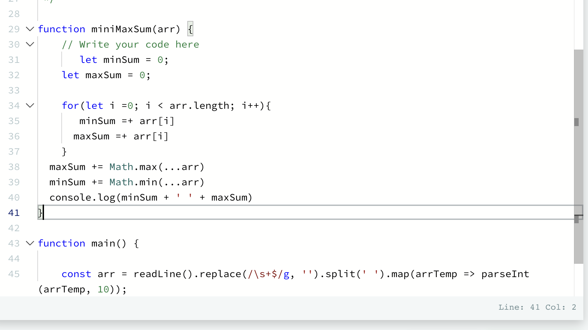

# Mini-Max Sum
## Steps :
1. First I set counter variables for the two different sums
2. I looped over the array length and addeed it to the min and max 
3. Then I got stuck and tried to use Math to calculate the totals but it wasn't working out
- I am trying to do a different approach now

